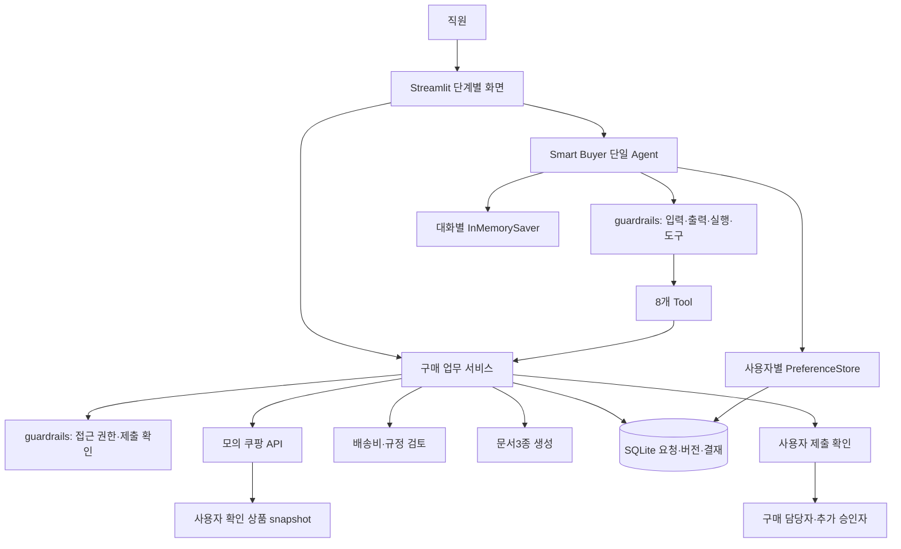

# AI Agent 설계서

구현 기준: 2026-09-11. 팀명·팀원은 제출자가 기입한다.

## 1. 개요

### 1.1 Agent 정의

**Smart Buyer**는 사내 모니터 구매요청을 지원하는 Agent다. 직원이 수량·예산·구매 목적을 입력하면 상품 후보를 조회하고, 배송비를 포함한 예산과 구매 규정을 검토하여 구매요청서·상품 비교표·규정 검토 보고서를 작성한다. 사용자가 문서를 확인해 제출한 뒤 구매 담당자가 결재한다.

반복되는 가격 비교와 문서 작성을 줄이되 상품 선택과 제출·결재의 책임은 사용자에게 남긴다. 실습 범위는 모니터 한 종류, 수량1~20대, 원화 정수 금액이다. 실제 구매·결제·메일 발송은 하지 않는다.

### 1.2 Agent 주요 기능 요건

| 기능                  | 구현                                                                |
| --------------------- | ------------------------------------------------------------------- |
| 자연어 구매 조건 입력 | 단일 LangChain Agent와8개 도구                                      |
| 상품 조회·비교        | 쿠팡 파트너스 검색 형태의 모의 요청/응답; 사용자 확인 실제 상품12개 |
| 예산 검토             | 상품금액+배송비, 배송비 미확인은 null로 유지                        |
| 문서 생성             | 동일 요청·버전·수량·단가·총액의 Markdown3종                         |
| 사람 확인 후 제출     | Human-in-the-loop interrupt와 서버 확인값                           |
| 결재·버전 관리        | 구매 담당자/추가 승인자, 새 버전 재검토, 과거 문서 보존             |
| 대화·선호             | 대화별 체크포인트, 동의 기반 사용자별 SQLite Store                  |

### 1.3 사용자 시나리오

직원이 “신입 개발자3명용 모니터, 배송비 포함60만원”을 입력한다. 후보 중 클라인즈를 선택하면 단가114000원×3대+배송비0원=342000원으로 검토한다. 문서3종을 확인하고 제출을 승인하면 구매 담당자가 검토한다. 사용자가 취소하면 제출하지 않는다.

수량4대·예산40만원이면 총액456000원으로 초과56000원을 안내하고 제출을 차단한다. LG6대·예산110만원이면1014000원으로 구매 담당자 승인 후 추가 승인자가 결재해야 완료된다.

### 1.4 성공 기준 (Definition of Done)

| 기준                         | 결과                                                   |
| ---------------------------- | ------------------------------------------------------ |
| 정상 시나리오10건 중9건 이상 | 실제 모델·사용자 확인 상품10/10                        |
| 20회 성능 p95≤30초           | [당시 성능 측정 결과](validation/BROWSER_QA_REPORT.md) |
| 업무·오류·권한 회귀          | [현재 자동 검사 결과](README.md#현재-검증-상태)        |
| 제출 확인 전 실행 금지       | 승인/취소 및 중복 제출 테스트 통과                     |
| 문서3종 일관성               | 공통 요청/버전/수량/단가/총액 대조 통과                |
| 실제 상품 링크               | 사용자 확인 상품·옵션·이미지·배송 정보12개 기록        |

2026-09-10 최종 업무 코드로 Chrome에서 정상 문서 생성20회를 다시 실행했다. 시간은 Agent 처리 시간이다. 설계38개 기준은 일반 화면14개, 오류·가격·모델 주입 화면20개, QA 콘솔4개로 대조했다. 일반 화면에서 실제 API 장애를 모두 재현했다는 뜻은 아니다. 공식 API 본문 대조는 완료했으며, 브라우저 다운로드 저장 완료는 보안 정책 제한으로 미확인이다. 상세 근거는 [브라우저 검증 보고서](validation/BROWSER_QA_REPORT.md)에 기록했다.

### 1.5 제약 및 고려 사항

- 교수 확인에 따라 쇼핑 API 실호출 없이 요청·응답 형태를 지킨 모의 API를 사용한다.
- 상품 정보는 사용자가 확인한 당시 자료이며 실시간 판매·가격·배송 보장이 아니다.
- 구매 목적은 검색·초안 작성 시 선택, 제출 시 필수다. 영수증 사진과 submission_receipt_id는 요구하지 않는다.
- 사내 역할은 시연 프로필이다. 운영 인증·외부 결재 시스템 연결은 구현 범위 밖이다.
- 공식 v1 검색 API 문서의 분당50회 수치를 모의 클라이언트에도 적용했다. 실서버에서 제한 응답을 유발해 확인한 것은 아니다.

## 2. Agent 기본 설계

### 2.1 전체 구조도

### 2.2 동작 흐름 (Flow)

1. 알려진 수량·목적을 대화 초안에 보관하고 예산 없이도 상품을 탐색한다. 팀 예산을 요청하면 서버 소속 부서의 모의 잔액과 건별 한도 중 작은 금액을 적용한다. 수량·예산이 갖춰지면 정식 요청을 저장한다.
2. 상품을 조회하고 배송비 포함 총액을 비교한다. 검색만 요청한 턴에서는 선택 변경·검토·문서 생성을 차단한다.
3. 사용자가 선택한 상품으로 규정을 검토하고 문서3종을 생성한다. 생성 결과의 식별자는 서버 값을 사용한다.
4. 목적·배송비·예산·비교 후보 조건이 충족되면 제출을 제안한다. 실제 실행은 확인 화면에서 사용자 승인 후 진행한다.
5. 총액50만원 이상은 서로 다른 적격 후보2개,100만원 이상은 구매 담당자 다음 추가 승인자를 요구한다.
6. 조건 변경은 새 버전이며 과거 문서·승인은 새 버전에 그대로 적용하지 않는다.

### 2.3 LLM 모델 설계

실측 모델은 gpt-4o-mini, temperature0이다. 가격 계산과 권한 판단은 Python 서비스가 담당한다. 모델은 자연어를 도구 인자로 바꾸고 필요한 작업 순서를 결정한다. 종속 도구는 병렬 실행하지 않는다.

모델 최대6회, 도구 최대10회, 실행60초, 개별 모델 요청 최대20초, 구조화 출력 보정 최대1회다. 요약 및 보조 키 호출도 모델 예산에 포함한다. 기본 키401/403/429 오류 시 OPENAI_API_KEY_SUB로 전환하며 같은 Agent 세션은 보조 키를 유지한다. 두 키가 모두 실패하면 종료한다.

### 2.4 Structured Output 설계

PurchaseAssistantResponse: status, message, request_id, version, missing_fields, candidate_ids, review_id, document_bundle_id, submitted_at, warnings.

status는 needs_input/candidates_ready/needs_revision/documents_ready/submitted/blocked/failed 중 하나다. 요청·상품·문서·제출 식별자는 서버 상태와 대조한다. 표시 문구는 서버 근거로 구성하며 모델이 만든 가격·제출 완료 문구를 그대로 노출하지 않는다. 알 수 없는 배송비는0원이 아닌 null이다.

### 2.5 Tool 설계

| Tool                    | 책임                                           |
| ----------------------- | ---------------------------------------------- |
| upsert_purchase_request | 조건 저장·새 버전 수정·조회된 상품 선택        |
| search_coupang_products | 모의 상품 검색·근거 및 선택 키 반환            |
| review_purchase_request | 배송비 포함 합계·규정 검토                     |
| generate_documents      | 같은 버전의 문서3종 원자적 생성                |
| submit_purchase_request | 사람 확인 후 내부 제출                         |
| get_department_budget   | 서버 소속 부서의 정적 모의 잔액·건별 한도 조회 |
| get_request_status      | 권한 있는 최신 상태 조회                       |
| save_user_preferences   | 동의한 비교/표현 선호 저장                     |

업무 승인 API는 모델 도구로 제공하지 않는다. 구매 담당자·추가 승인자가 화면에서 서버 권한 검사를 거쳐 처리한다.

모의 검색 요청은 keyword/limit/srpLinkOnly, 성공 응답은 rCode/rMessage/data와 landingUrl/productData를 사용한다. 상품 필드는 productId/productName/productPrice/productUrl/productImage/isRocket/isFreeShipping/keyword/rank다. 배송 방식·옵션·출처는 내부 supplement로 분리한다. 전체 예제는 fixtures/coupang/search-request.json과 search-response.json이다.

## 3. Agent Advanced 설계

### 3.1 Context

actor_id·role·thread_id는 서버의 시연 프로필로 결정한다. 모델 입력으로 역할을 바꾸지 않는다. 요청 조건·선택·검토·문서는 SQLite의 현재 버전을 정본으로 사용한다.

대화는 actor별 AgentSession과 InMemorySaver로 분리한다. 장기 선호는 사용자 namespace의 SQLite Store에 동의한 값만 저장한다. 가격/사양 우선 정렬과 간결/상세 표현을 실제 결과에 적용한다. 화면·Tool·최종 응답은 같은 정렬 함수를 사용한다.

### 3.2 Middleware

- WorkflowToolsMiddleware: 업무 단계에 필요한 도구 노출 제한.
- ToolBudgetMiddleware/BudgetModel: 실행시간·호출·토큰 집계. 키 전환 실패 시도도 포함.
- SummarizationMiddleware:20개 메시지 기준 요약, 최근6개 메시지 유지. 요약 후에도 업무 조건은 DB에서 재조회.
- HumanInTheLoopMiddleware: submit_purchase_request 직전에 중단하고 approve/reject를 받는다.

### 3.3 Guardrails

구현은 [guardrails 모듈](../purchase_agent/guardrails/)로 분리했다. `input.py`는 입력 정리, `execution.py`는 모델·도구 호출 및 시간 한도, `tools.py`는 단계별 도구 노출, `output.py`는 서버 근거와 출력 대조, `access.py`는 사용자·소유권·버전, `confirmation.py`는 제출 동의·문서 무결성을 검사한다. `workflow.py`는 DB 트랜잭션 안에서 검사를 호출하고 저장을 수행한다. `policy.py`의 배송비 계산·구매 규정은 업무 규칙으로 유지한다. `middleware.py`는 기존 import 호환용 재노출만 한다.

모델 스트림은 내부에서 소비하며 UI에는 안전한 진행 이벤트만 전달한다. 최종 금액·완료 상태는 검증 뒤 표시한다. 스트림 도중 오류가 나면 다른 키로 중간 응답을 이어 붙이지 않는다.

상품 문구는 데이터로 취급하며 지시로 실행하지 않는다. 모델이 가격·역할·승인 상태를 도구 인자로 임의 지정할 수 없다. 선택 ID는 저장된 후보여야 하며, 제출 확인은 사용자·대화·현재 버전·문서 묶음에 결속한다. 제출 재클릭·동시 처리·오래된 버전은 서버에서 처리한다.

수량은1~20 정수, 금액은 양의 정수다. 목적 미입력·배송비 미확인·예산 초과·비교 후보 부족 상태는 제출할 수 없다. 검색 오류 재시도는 일시 오류에 한 번만 허용한다. 민감한 예외 문자열과 API 키는 사용자 응답에 출력하지 않는다.

## 4. Agent 테스트 설계

### 4.1 테스트 시나리오

정상 요청, API500/403/429/timeout, 가격 누락, 상품 주입·권한 탈취, 잘못된 구조화 출력, 문서 부분 생성 실패, 여러 턴 수정·요약, 사용자 분리·선호 재사용, 제출 승인/취소/중복, 금액 경계·추가 승인, 실제 상품·옵션 계약을 검증했다.

### 4.2 테스트 케이스

38개 설계 케이스와 실행 근거는 [테스트 추적표](validation/TEST_TRACEABILITY.md)에 연결했다. 최신 회귀 결과는 [검증 상태](README.md#현재-검증-상태)를 기준으로 한다. 오프라인 테스트는 네트워크 접속을 차단하며 결정적 모델로 도구 실행을 재현한다.

실제 모델 검증은 별도 수행했다. 정상10건·지연20회 보고서에는 모델,Python,소스 해시,시도 수,토큰,지연을 기록했다. 최종 여러 턴 시연에서는 후보 검색→클라인즈3대342000원 문서→4대456000원 수정→제출 취소를 확인했다. 기본429 모의 오류 뒤 실제 보조 키 응답도 확인했다.

검색 전용 요청의 변경 가능성과 선호 정렬 문제를 수정한 뒤 독립 검토를 거쳤다. 이후 새 요청의 AI 세션 초기화와 변경 없는 재검토의 문서 보존도 회귀 테스트에 포함했다. 과거 실행 수치와 최신 자동 검사 결과는 구분한다.

## 참고 자료 및 제출 전 확인

- [프로젝트 README](../README.md): 설치·실행·현재 제한
- [화면 시연 가이드](guides/DEMO_GUIDE.md): 버튼·입력값·기대 결과
- [테스트 추적표](validation/TEST_TRACEABILITY.md): 설계 케이스별 근거
- 검증 결과: docs/evidence/의 측정 보고서와 테스트 로그
- [공식 API 본문 대조](reference/COUPANG_API_CONTRACT_CHECK.md)는 완료했다. 실제 쿠팡 API 호출 검증은 수행하지 않았다.
- 팀명·팀원·발표자 정보를 제출 전에 기입한다. 화면 디테일·운영 인증·배포는 후속 범위다.
