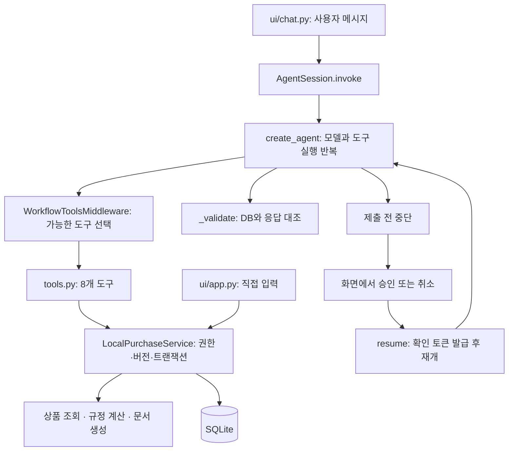

# Agent 코드 읽기 안내

SK-TASK는 단일 Agent가 8개 도구를 선택해 호출하는 구조다. 화면의 직접 입력과 AI 입력은 같은 업무 서비스에 연결된다.

## 읽는 순서

1. [agent.py](../../purchase_agent/agent.py)의 `AgentSession._build_graph`: 모델, 도구, 구조화 응답, 미들웨어와 메모리를 조립한다.
2. [tools.py](../../purchase_agent/tools.py)의 `build_tools`: 조건 저장 → 검색 → 선택 → 검토 → 문서 → 제출의 접점을 본다. 선택은 `upsert_purchase_request`를 다시 호출한다. 조회·선호 저장 도구는 보조 역할이다.
3. [guardrails/tools.py](../../purchase_agent/guardrails/tools.py)의 `WorkflowToolsMiddleware`: 매 모델 호출마다 노출 도구를 제한한다. [guardrails/execution.py](../../purchase_agent/guardrails/execution.py)의 `BudgetModel`과 `ToolBudgetMiddleware`는 호출 횟수와 시간을 제한한다.
4. [schemas.py](../../purchase_agent/schemas.py): 요청, 상품 근거, 검토, 문서와 응답 형식을 찾아본다.
5. [workflow.py](../../purchase_agent/workflow.py)의 `LocalPurchaseService`: UI와 AI가 공유하는 실제 업무 처리다. 조건·후보 변경 시 새 버전을 만들고, 변경 없는 재검토는 문서를 보존한다.
6. [policy.py](../../purchase_agent/policy.py), [documents.py](../../purchase_agent/documents.py): 배송비 포함 금액과 승인 조건을 계산하고 문서 3종을 생성한다.
7. [ui/app.py](../../purchase_agent/ui/app.py)에서 내 업무·단계별 작성·요청 상세·결재 검토를 확인한다. [ui/state.py](../../purchase_agent/ui/state.py)는 사용자 안에서 요청별 대화를 분리한다. [ui/chat.py](../../purchase_agent/ui/chat.py) → `AgentSession.invoke` → `_run` → `_validate` 순서로 AI 실행을 따라간다.
8. [ui/confirmations.py](../../purchase_agent/ui/confirmations.py)는 직접 입력과 AI의 공통 확인 창이다. 직접 입력은 준비한 확인 토큰으로 제출하고, AI는 `resume`으로 중단된 제출을 재개한다. 두 경로 모두 서버가 최신 버전·문서·권한을 다시 검증한다.

## 한 사례 따라가기

- “모니터 3대, 예산 60만 원으로 찾아줘”: 조건 저장과 검색까지만 실행한다.
- “클라인즈 선택하고 문서 만들어줘”: 상품 선택 후 검토하고 문서를 생성한다.
- “제출해줘”: 제출 도구 실행 전에 멈춰 확인 화면을 표시한다. 승인 시 현재 문서의 확인 토큰을 발급받아 제출하고, 취소하면 제출하지 않는다.

이 순서는 고정된 노드 순서를 선언한 그래프가 아니다. 모델이 도구를 선택하고, 미들웨어와 업무 서비스가 실행 가능한 범위를 제한한다. 도구의 성공 여부와 DB 상태가 실제 처리 결과의 근거다.

## 상태를 구분해서 보기

| 상태                    | 보관 위치                      | 역할                                                                  |
| ----------------------- | ------------------------------ | --------------------------------------------------------------------- |
| 대화·중단 지점          | Agent의 `InMemorySaver`        | 여러 턴과 제출 확인 재개. 프로세스 재시작 시 유지되지 않는다.         |
| 현재 AI 작업 대상       | `AgentSession.current_request` | 다음 턴에 DB에서 읽을 요청 ID. 요청별 Agent가 각자의 대화를 이어간다. |
| 구매요청·버전·문서·결재 | SQLite                         | 업무 데이터의 기준. 모델의 대화 요약으로 대체하지 않는다.             |
| 사용자 선호             | SQLite와 `PreferenceStore`     | 동의한 비교·표현 선호만 사용자별로 저장한다.                          |

`@tool` 함수의 docstring은 모델에 전달되는 도구 설명이다. 개발자용 설명을 보강할 때는 일반 주석을 사용하고, 도구 설명을 수정하면 AI 동작 변경으로 검증한다.

화면의 대화는 사용자별 `actor_sessions` 안의 `conversations[request_id]`에 둔다. 새 요청은 별도 `draft_chat`으로 시작하고 저장 후 요청 ID에 연결한다. 직접 수정으로 버전이 바뀌면 실행 그래프를 초기화하고 표시용 대화는 보존한다. 화면 이동은 대기 중인 제출을, 사용자 전환은 실행 상태를 폐기한다. 다른 사용자의 요청과 과거 버전에서는 AI 수정·제출을 표시하지 않는다.

## 가드레일 모듈

가드레일은 모델과 사용자의 입력이 업무 상태를 잘못 바꾸지 않도록 검사하는 경계다. 다음 순서로 읽으면 각 검사의 위치와 호출자를 함께 볼 수 있다.

| 파일                                                               | 검사                                                    | 호출 위치                |
| ------------------------------------------------------------------ | ------------------------------------------------------- | ------------------------ |
| [input.py](../../purchase_agent/guardrails/input.py)               | 개인정보 마스킹·입력 길이 제한                          | Agent 입력과 표시 메시지 |
| [tools.py](../../purchase_agent/guardrails/tools.py)               | 검색만 요청한 턴, 준비되지 않은 문서·제출 도구 차단     | 모델 호출 직전           |
| [execution.py](../../purchase_agent/guardrails/execution.py)       | 모델 6회·도구 10회·60초, 토큰 집계, 스트림 오류         | 모델 및 도구 실행        |
| [output.py](../../purchase_agent/guardrails/output.py)             | 상품·버전·검토·문서·제출 완료를 서버 근거와 대조        | 최종 응답 직전           |
| [access.py](../../purchase_agent/guardrails/access.py)             | 시연 사용자·부서·역할·요청 소유권·최신 버전             | 업무 서비스 조회·변경    |
| [confirmation.py](../../purchase_agent/guardrails/confirmation.py) | 제출 동의의 사용자·대화·버전 결속, 토큰 만료, 문서 해시 | 제출 트랜잭션 내부       |

`schemas.py`는 자료형·값 범위를, `policy.py`는 배송비와 구매 규정을 담당한다. `workflow.py`는 DB를 읽고 가드레일을 호출한 뒤 저장한다. 도구 노출 제한만으로 권한을 보장하지 않으며, 직접 입력 화면도 서비스의 같은 검사를 거친다. 기존 `middleware.py`는 호환용 import만 제공한다.

## 예산 없는 요청과 진행 표시

1. “우리 부장님 모니터 바꿔야함. 제일 비싼걸로 1개 구매요청서 만들어줘”: `DraftInput`에 알려진 수량·목적을 보관하고 요청 ID 없이 검색한다. 정식 요청은 아직 생성하지 않는다.
2. “우리 팀 예산에 맞게”: `get_department_budget`과 [budgets.py](../../purchase_agent/budgets.py)의 정적 모의 한도를 사용한다. `development`는 잔액 120만 원·건별 한도 50만 원이므로 이번 요청 예산은 50만 원이다. 잔액 예약·차감 기능은 없다.
3. 검색 후보 중 조건에 맞는 상품을 선택하고 기존 검토→문서 흐름을 이어간다. 정렬은 내부 모의 카탈로그에서 적용하며 실제 쿠팡 전체의 최저·최고가를 뜻하지 않는다.
4. [ui/execution.py](../../purchase_agent/ui/execution.py)는 작업 스레드의 이벤트를 큐로 받아 Streamlit 화면 스레드에서 진행 단계를 갱신한다. 모델 원문 대신 도구 시작·완료를 표시하고, 검증된 최종 답변만 대화에 저장한다.
